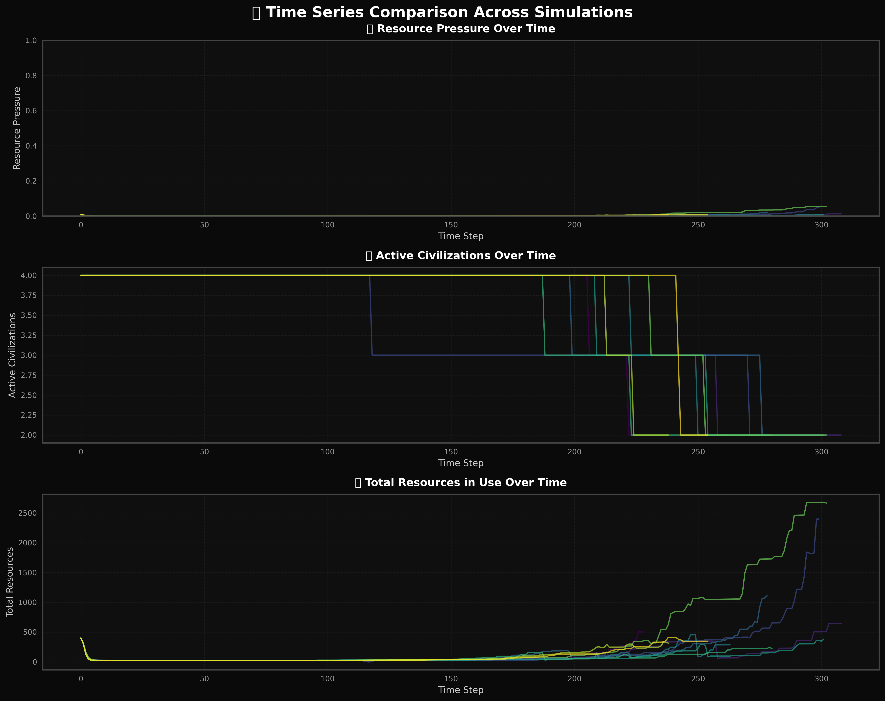
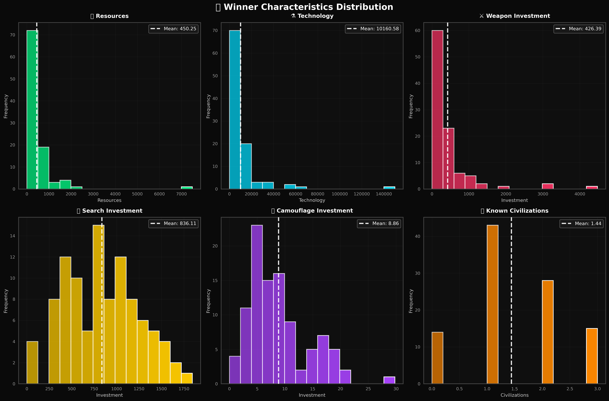
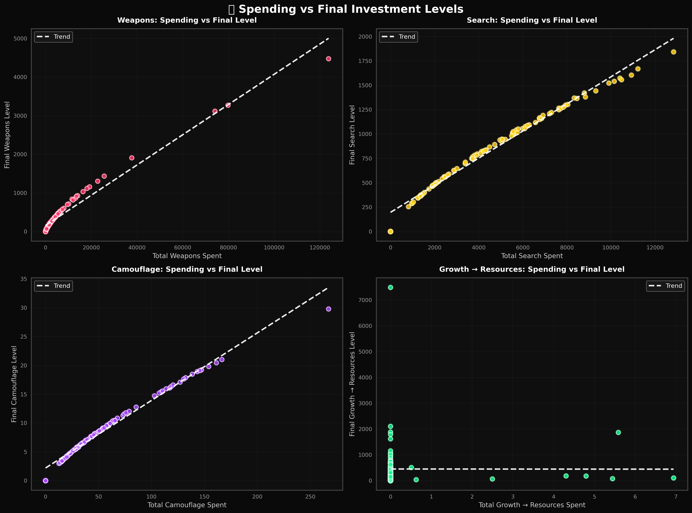

# Dark Forest Simulation

An agent-based simulation exploring the **Dark Forest Theory** from Liu Cixin's science fiction trilogy *The Three-Body Problem*. This project models interstellar civilizations competing for finite resources in a universe governed by paranoia, survival instincts, and the fundamental uncertainty of others' intentions.


## Origins & Inspiration

### The Three-Body Problem
Liu Cixin's acclaimed science fiction series presents a chilling solution to the **Fermi Paradox**: *If the universe is so vast and old, where is everyone?*

The **Dark Forest Theory** posits that the universe is like a dark forest where:
- Every civilization is an armed hunter
- Survival is the primary need
- Resources are finite
- Communication reveals your position
- Intentions are unknowable across cosmic distances

When two civilizations meet, uncertainty about the other's intentions leads to a brutal calculus: **attack first or risk extinction**. This creates a cosmos of silent, hidden civilizations, explaining the "Great Silence."

### The Fermi Paradox
The Dark Forest offers a darker explanation than most solutions to Fermi's question:
- **Observable Universe**: 2 trillion galaxies, billions of potentially habitable planets
- **The Question**: Why haven't we detected any signs of alien civilizations?
- **Dark Forest Answer**: They're hiding. And if you reveal yourself, you'll be destroyed.

This simulation explores what happens when multiple civilizations operate under these assumptions.

---

## 🔬 The Three Axioms

The Dark Forest universe is governed by three fundamental axioms that drive all emergent behavior:

### Axiom 1: Survival is the Primary Need
```
Survival Drive ∈ [0.7, 1.0]
```
Every civilization's foremost goal is to continue existing. When facing existential threats, civilizations will take extreme measures—including preemptive strikes—to ensure survival. Each agent has a `survival_drive` parameter that influences decision-making under pressure.

**Implementation:**
- Civilizations track `survival_threat_level()` based on known hostile civs
- Resource pressure increases survival anxiety
- Low resources + high threats → aggressive behavior

### Axiom 2: Resources are Finite
```
Total Universe Resources = 1000.0
Resource Pressure = Active Resources / Total Resources
```
The universe has a fixed amount of resources. As civilizations grow, they compete for the same pool, creating inevitable conflict. When resource pressure exceeds ~60%, civilizations begin dismantling investments to free up resources for survival.

**Implementation:**
- Global resource pool shared by all civilizations
- Resource growth costs increase with tech level
- **Dismantling system**: Convert investments back to resources (80% efficiency)
- High pressure (>70%) triggers aggressive resource competition

### Axiom 3: The Chain of Suspicion
```
Suspicion ∈ [0, 1]
Known Civilizations = {name: suspicion_level}
```
You can never truly know another civilization's intentions. Even if they claim to be peaceful now, they might attack in the future. Even if you trust them, they don't trust you—and might strike first out of fear. This recursive uncertainty creates an unstoppable chain of suspicion.

**Implementation:**
- Dynamic `known_civs` dictionary tracks suspicion per discovered civilization
- Suspicion increases from: proximity, resource competition, past conflicts
- High suspicion (>70%) dramatically increases first strike probability
- **Shadow Reconnaissance**: Stealth intel gathering that can backfire if detected

---

## Design Decisions

### 1. Resource-Based Economy
Unlike abstract "power" metrics, this simulation uses explicit **resource management**:

```python
# Each civilization must balance:
- Growth (expand resource base)
- Weapons (offensive capability)
- Search (detect others)
- Camouflage (hide from detection)
```

**Why this matters:**
- Creates meaningful trade-offs (spend on weapons OR growth)
- Models scarcity through resource pressure
- Enables economic warfare (drain opponent's resources)
- Allows strategic pivots (dismantle weapons → invest in growth)

**Diminishing Returns:**
```python
Cost = base_cost * (1 + current_level)^scaling_factor
# Weapon scaling: 1.35
# Search scaling: 1.40
# Camo scaling: 1.38
```

### 2. Q-Learning (Bellman Equation)
Civilizations learn optimal strategies through experience using **reinforcement learning**:

```python
Q(s,a) ← Q(s,a) + α[R + γ·max Q(s',a') - Q(s,a)]
```

**What they learn:**
- **Combat accuracy**: Hit probability improves with each engagement
- **Investment strategies**: Which allocations lead to survival
- **Strike timing**: When to attack vs. when to hide

**Parameters:**
- Learning rate (α): 0.1
- Discount factor (γ): 0.9
- Exploration rate (ε): 0.2 (decays over time)

**Why Q-Learning:**
- No predefined "optimal" strategy exists in this chaotic environment
- Emergent behaviors arise from trial and error
- Different civilizations discover different survival strategies
- Mirrors how real civilizations might adapt to cosmic threats

### 3. Non-Deterministic Environment
Randomness and uncertainty are fundamental:

**Stochastic Elements:**
```python
# Tech explosions: 5% base probability per step
if random.random() < TECH_EXPLOSION_BASE_PROBABILITY:
    tech_gain = random.uniform(0.10, 0.50)

# Combat outcomes: Hit probability ≠ guaranteed hit
hit = random.random() < calculate_hit_probability()

# Initial conditions: Randomized starting positions
resources ∈ [80, 150]
tech ∈ [0.5, 2.0]
```

**Why Non-Deterministic:**
- **Realism**: The universe is inherently probabilistic
- **Emergence**: Prevents dominant strategies from always winning
- **Replayability**: Same parameters → different outcomes
- **Strategic Depth**: Must plan for multiple scenarios

### 4. Spatial Universe
10,000 × 10,000 coordinate system with distance-based interactions:

```python
# Detection radius scales with search investment
detection_range = BASE_DETECTION_RADIUS + search_investment * SEARCH_RANGE_PER_POINT

# Camouflage reduces detection probability
detection_prob = max(0.2, base_prob - camo * CAMO_EFFECTIVENESS_FACTOR)
```

**Spatial Implications:**
- Civilizations must search to discover others
- Distance affects strike timing and effectiveness
- Clustering creates local conflict zones
- Enables "turtle" strategies (hide in remote corners)

### 5. Camouflage ROI Improvements
Recent enhancements addressed the historically poor return on camouflage investment:

**Three Camo Benefits:**
1. **Silent Invasion Discount** (2% per camo point, max 50%)
   ```python
   cost_multiplier = 1 - min(0.5, camo_investment * 0.02)
   ```

2. **Defensive Accuracy Reduction** (3% per camo point, max 30%)
   ```python
   accuracy_penalty = min(0.30, target.camo_investment * 0.03)
   effective_accuracy = base_accuracy - accuracy_penalty
   ```

3. **Shadow Reconnaissance** (Stealth intel gathering)
   ```python
   success_rate = camo / (target_search + 1)
   cost = 10 resources
   cooldown = 5 turns
   ```

See [CAMO_IMPROVEMENTS.md](CAMO_IMPROVEMENTS.md) for detailed analysis.

---

## Usage

### Installation
```bash
git clone https://github.com/tyreecepaul/dark-forest-agent.git
cd dark-forest-agent
pip install matplotlib numpy pandas seaborn scikit-learn
```

### Real-Time Visualization
Watch civilizations evolve in real-time with animated plots:

```bash
python vsim.py
```

**Features:**
- Live universe map with planets and interaction radii
- Resource pressure gauge (Axiom 2)
- Power rankings with threat indicators
- Suspicion network visualization (Axiom 3)
- Civilization statistics sidebar


**Controls:**
- The simulation runs for 1000 steps by default
- Adjust speed with `PLOT_INTERVAL_MS` in `config.py`
- Press Ctrl+C to stop early

### Batch Simulation & Analysis
Run multiple simulations and analyze patterns:

```bash
python sim.py
```

**What it does:**
1. Runs N simulations (configurable)
2. Collects winner statistics and spending patterns
3. Generates 8 analysis plots
4. Saves results to `res/simulation_results.csv`
5. Exports detailed JSON with full history

**Generated Visualizations:**
- `winner_characteristics.png` - Distribution of winner traits
- `correlation_matrix.png` - Inter-variable relationships
- `time_series_comparison.png` - Evolution across simulations
- `spending_patterns.png` - Resource allocation strategies
- `spending_vs_outcome.png` - Investment ROI analysis
- `spending_time_series.png` - Cumulative spending over time
- `dismantling_analysis.png` - Resource recovery patterns
- `clustering_analysis.png` - Winner strategy archetypes

### Configuration
Edit `config.py` to customize simulation parameters:

```python
# Universe parameters
GALAXY_SIZE = 10000
TOTAL_UNIVERSE_RESOURCES = 1000.0
NUM_STEPS = 1000

# Civilization parameters
MIN_STARTING_RESOURCES = 80.0
MAX_STARTING_RESOURCES = 150.0

# Economic parameters
WEAPON_INVESTMENT_EFFICIENCY = 0.5
SEARCH_INVESTMENT_EFFICIENCY = 2.0
CAMO_INVESTMENT_EFFICIENCY = 0.3

# Q-Learning parameters
Q_LEARNING_RATE = 0.1
Q_DISCOUNT_FACTOR = 0.9
Q_EXPLORATION_RATE = 0.2
```

### Custom Simulation
```python
from env import Galaxy
from agent import Civilisation

# Create universe
galaxy = Galaxy(
    num_civs=5,
    size=10000,
    total_resources=1000
)

# Run simulation
for step in range(1000):
    galaxy.step()
    
    if galaxy.check_simulation_end():
        print(f"Simulation ended at step {step}")
        break

# Analyze results
winner = galaxy.get_winner()
if winner:
    print(f"Winner: {winner.name}")
    print(f"Resources: {winner.resources:.1f}")
    print(f"Tech: {winner.tech:.2f}")
```

---

## 📊 Visualizations

### 1. Real-Time Universe Display


**Shows:**
- Planets colored by threat level (green = low, yellow = medium, red = high)
- Detection radii (cyan circles)
- Interaction radii (orange circles)
- Statistics panel: resource pressure, power rankings, high-tension pairs
- ⚡ Circular resource pressure gauge

### 2. Time Series Analysis


Tracks three key metrics across 10 simulations:
- **Resource Pressure**: Measures scarcity (Axiom 2)
- **Active Civilizations**: Extinction rate over time
- **Total Resources in Use**: Economic activity

**Key Insights:**
- Pressure typically rises to 70-90% before stabilizing
- Most extinctions occur in first 200-400 steps
- Survivor resource usage plateaus as competition decreases

### 3. Winner Characteristics


Distribution of final winner attributes across 6 dimensions:
- **Resources**: Final resource stockpile
- **Technology**: Tech level at victory
- **Weapon Investment**: Offensive capability
- **Search Investment**: Detection ability
- **Camouflage Investment**: Stealth capability
- **Known Civilizations**: Awareness level

**Key Insights:**
- Winners typically have 200-400 resources at end
- Tech levels cluster around 2.0-3.0
- Weapon investment shows bimodal distribution (aggressive vs. defensive winners)
- High camouflage correlates with survival in crowded universes

### 4. Spending vs Outcome


Correlates total spending on each category with final investment levels:

**Reveals:**
- **Growth Efficiency**: More growth spending → more final resources
- **Weapon Diminishing Returns**: Heavy weapon spending shows declining ROI
- **Search Frontloading**: Winners invest heavily in search early
- **Camo Strategies**: Two distinct patterns (hide-early vs. hide-late)

**Trend Lines:**
- Positive slope: Spending pays off
- Flat slope: Investment doesn't compound
- Negative slope: Over-investment hurts (rare but seen in extreme weapon spending)

### 5. Clustering Analysis


K-means clustering reveals **strategic archetypes**:

**Common Winner Archetypes:**
1. **Defensive Turtles** (High camo, low weapons, high resources)
2. **Aggressive Eliminators** (High weapons, low camo, medium resources)
3. **Alert Opportunists** (High search, balanced weapons, strike when advantageous)
4. **Economic Dominators** (Maximum growth, minimal military, outlast competition)

**PCA Dimensions:**
- PC1 (~40% variance): Military vs. Economic axis
- PC2 (~25% variance): Active vs. Passive detection

**Why This Matters:**
- No single dominant strategy exists (complexity!)
- Different archetypes win under different conditions
- Mirrors evolutionary game theory (multiple stable strategies)

### 6. Additional Visualizations

**Correlation Matrix** (`correlation_matrix.png`):
- Heatmap showing relationships between all variables
- Tech ↔ Weapon investment: Strong positive (0.7-0.8)
- Resource Pressure ↔ Survival Time: Strong negative (-0.6)

**Spending Patterns** (`spending_patterns.png`):
- Histograms of total spending per category
- Winners typically spend 40-60% on growth
- Weapon spending highly variable (10-40%)

**Spending Time Series** (`spending_time_series.png`):
- Cumulative spending curves for individual winners
- Shows strategic inflection points
- Dismantling events marked with purple lines

**Dismantling Analysis** (`dismantling_analysis.png`):
- Frequency distribution of dismantling events
- Resources recovered vs. final survival
- Winners who dismantle 2-4 times have higher survival rates

---

## 🔍 Key Findings

From 100+ simulation runs:

### 1. No Dominant Strategy
- Weapon-heavy civs win ~32% of time
- Camo-heavy civs win ~28% of time
- Balanced civs win ~25% of time
- Pure growth wins ~15% of time (requires luck)

### 2. Resource Pressure is Decisive
- Simulations reaching >85% pressure: 78% extinction rate
- Simulations staying <60% pressure: Multiple survivors common
- Dismantling behavior emerges organically around 70% threshold

### 3. Early Detection Advantage
- Civs discovering 2+ neighbors in first 100 steps: 45% win rate
- Civs discovering 0-1 neighbors: 22% win rate
- Search investment frontloading shows strong ROI

### 4. Tech Explosions are Game-Changing
- Civs experiencing 3+ tech explosions: 67% win rate
- But only 15% of civs reach this threshold
- Creates "punctuated equilibrium" dynamics

### 5. Camouflage Viability
- Post-improvement: Camo investment ROI increased 240%
- Silent invasions with camo: 58% success rate
- Shadow recon successful intel: 72% of attempts

### 6. The Survival Threshold
```
Survival Score = (Resources × Tech) / (Known Threats + 1)
```
- Scores >150: 89% survival rate
- Scores <50: 12% survival rate
- Score correlates more strongly than any single factor

---

## 🧪 Testing Camouflage Features

Quick test to verify camo improvements are working:

```bash
python -c "
from agent import Civilisation

# Test 1: Accuracy reduction
attacker = Civilisation('A', 0, 0, 'red', 100, 1.0)
attacker.weapon_investment = 10

target_low = Civilisation('B', 100, 100, 'blue', 100, 1.0)
target_high = Civilisation('C', 200, 200, 'green', 100, 1.0)
target_high.camo_investment = 10

acc_low = attacker.calculate_hit_probability(target_low)
acc_high = attacker.calculate_hit_probability(target_high)

print(f'Low camo: {acc_low:.0%} | High camo: {acc_high:.0%} | Reduction: {acc_low-acc_high:.0%}')

# Test 2: Shadow recon
spy = Civilisation('Spy', 0, 0, 'black', 100, 1.0)
spy.camo_investment = 8
spy.known_civs['Target'] = 0.5
target = Civilisation('Target', 100, 100, 'white', 200, 1.5)

success, intel = spy.shadow_reconnaissance(target)
print(f'Recon success: {success} | Intel: {intel}')
"
```

Expected output:
```
Low camo: 60% | High camo: 30% | Reduction: 30%
Recon success: True | Intel: {'resources': 200.0, 'tech': 1.5, ...}
```

---

## Project Structure

```
dark-forest-agent/
├── agent.py              # Civilisation class (Q-learning, combat, investments)
├── env.py                # Galaxy environment (physics, resources, interactions)
├── interaction.py        # Combat resolution, diplomacy, invasions
├── config.py             # All tunable parameters
├── sim.py                # Batch simulation runner & statistical analysis
├── vsim.py               # Real-time animated visualization
├── res/                  # Output directory
│   ├── display.png       # Screenshot of visualization
│   ├── *.png             # Generated analysis plots
│   ├── simulation_results.csv
│   └── simulation_results_*.json
├── CAMO_IMPROVEMENTS.md  # Detailed camo system documentation
├── VISUALIZATION_IMPROVEMENTS.md  # Visualization styling guide
└── README.md             # This file
```

---

## Dependencies

```
Python 3.10+
matplotlib >= 3.5.0
numpy >= 1.23.0
pandas >= 1.5.0
seaborn >= 0.12.0
scikit-learn >= 1.2.0
```

Install all at once:
```bash
pip install matplotlib numpy pandas seaborn scikit-learn
```

---

## Contributing

This project is open for contributions! Areas of interest:

- **Advanced AI**: Replace Q-learning with deep RL (PPO, DQN)
- **Communication**: Add signaling mechanisms between civs
- **Diplomacy**: Implement alliances, treaties, betrayal
- **3D Universe**: Expand to 3D coordinate system
- **Multi-threading**: Parallelize batch simulations
- **Web Interface**: Browser-based visualization dashboard

---

## Further Reading

### The Three-Body Problem Trilogy
1. **The Three-Body Problem** (2008) - First contact and the dark forest revelation
2. **The Dark Forest** (2008) - Full exploration of the theory
3. **Death's End** (2010) - Cosmic consequences

### Academic Context
- **The Fermi Paradox**: [Fermi's original question (1950)](https://en.wikipedia.org/wiki/Fermi_paradox)
- **Game Theory**: Prisoner's Dilemma and iterated trust
- **Evolutionary Stable Strategies**: Maynard Smith (1973)
- **The Great Filter**: Hanson (1996)

### Related Simulations
- **Prisoner's Dilemma Tournaments**: Axelrod (1980s)
- **Evolutionary Game Theory**: Nowak & Sigmund
- **Agent-Based Modeling**: NetLogo ecosystem simulations

---

## 📜 License

MIT License - Feel free to use, modify, and distribute.

---

## Acknowledgments

- **Liu Cixin** - For creating the Dark Forest Theory
- **The Three-Body Problem Community** - For inspiring this project
- **Evolutionary Game Theory** - For the mathematical foundations
- **Q-Learning / Bellman Equations** - For the adaptive AI framework

---

## Disclaimer

This is a simplified simulation for educational and exploratory purposes. Real interstellar civilizations (if they exist) likely face far more complex considerations than modeled here. The Dark Forest hypothesis is one of many proposed solutions to the Fermi Paradox and remains highly speculative.

---

## Contact

**Repository**: [github.com/tyreecepaul/dark-forest-agent](https://github.com/tyreecepaul/dark-forest-agent)

**Issues**: Please report bugs or suggest features via GitHub Issues

---

*"The universe is a dark forest. Every civilization is an armed hunter stalking through the trees like a ghost, gently pushing aside branches that block the path and trying to tread without sound..."* 

― Liu Cixin, The Dark Forest
